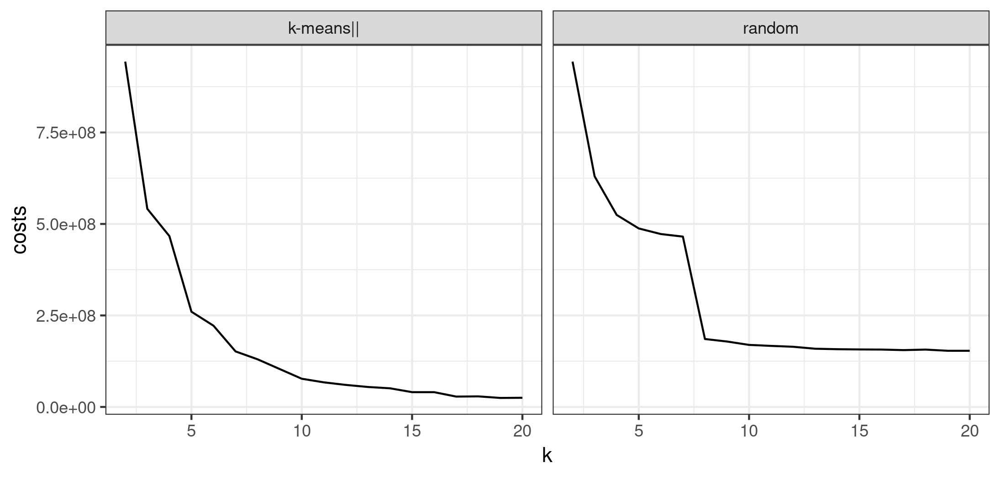
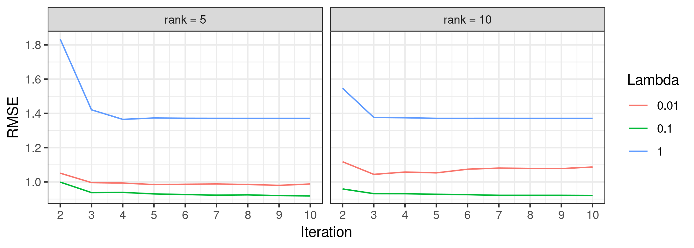
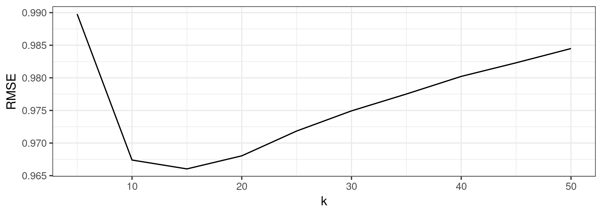

## Testat 1

Das erste Testat dient zum "warm werden" mit Spark. Zunächst sollen Sie  das "Hallo Welt!"-Beispiel aus der Einführung geringfügig abändern. Anschließend werden Sie zur Arbeit mit der ML-Bibliothek von Spark angeleitet. Beachten Sie hierbei, dass inzwischen zwei verschiedene Versionen dieser Bibliothek existieren. Da Sie in diesem Praktikum ausschließlich RDDs verwenden sollen, müssen Sie die "ältere" Version verwenden: <https://spark.apache.org/docs/latest/mllib-guide.html>

Die ML-Bibliothek von Spark beinhaltet einige Implementierungen von Data-Mining-Algorithmen. Diese können Sie in den Aufgaben 2, 3, und 4a) verwenden. In Aufgabe 4b) sollen Sie selbständig einen Algorithmus zum Collaborative Filtering implementieren. Da dafür noch keine Implementierung in Spark existiert, ist diese Aufgabe deutlich umfangreicher als die vorherigen.

### Allgemeine Hinweise

- Schreiben Sie Ihre Programme schrittweise. Die Befehle `count()` und `take(5)` sind hilfreich, wenn Sie Zwischenergebnisse überprüfen möchten. In einer lokalen Spark-Instanz können Sie die Ergebnisse über `System.out.println` ausgeben. 
- Versuchen Sie möglichst oft mit PairRDDs zu arbeiten. Nützliche Operatoren wie `groupByKey()`, `reduceByKey()` oder `join()` sind nur für diese speziellen RDDs verfügbar. 
- Wichtig bei der Arbeit mit PairRDDs ist eine sinnvolle Definition der Schlüssel. Bei mehrwertigen Schlüsseln eignen sich die Tupel von Scala oder Collections von Java (Vermeiden Sie Arrays).
- Standardmäßig wird eine RDD bei jeder Ausführung einer Aktion (z.B. `collect()`, `count()`, `take(n)`, `saveAsTextFile(path)`) neu berechnet. Sie können eine RDD jedoch über den Operator `cache()` im Speicher behalten. Wenn Sie also eine RDD mehrmals verwenden möchten, könnte eine Persistierung über `cache()` die Ausführungszeit deutlich verringern.
- Beachten Sie, dass lokal definierte Variablen nicht automatisch auf alle Server eines Spark-Clusters verteilt werden. Wenn Sie bei der Verarbeitung von RDDs auf lokale Variablen zugreifen möchten, müssen Sie diese entweder über die Elemente der RDD oder über den Spark-Kontext verteilen (Broadcast): <https://spark.apache.org/docs/latest/rdd-programming-guide.html#shared-variables>
- In einigen Aufgaben werden Sie aufgefordert, verschiedene Parameter der Algorithmen auszuprobieren. Obwohl man solche Parameter-Sweeps gut parallelisieren könnte, ist dies hier ausdrücklich nicht gewollt. Eine Parallelisierung der Parameter-Sweeps würde implizieren, dass jeder ausführende Server den vollen Datensatz zur Verfügung hat. Wir gehen hier allerdings davon aus, dass die Daten verteilt vorliegen und die Algorithmen verteilt ausgeführt werden. Der Parameter-Sweep wird also von dem ausführenden "Driver Program" sequentiell durchgeführt. Praktisch bedeutet dies, dass in der `main()`-Methode eine oder mehrere `for`-Schleifen implementiert sind, welche den jeweiligen (verteilt arbeitenden) Algorithmus mit verschiedenen Parametern aufrufen.
- Je nachdem, wie Sie Ihre Algorithmen schreiben, reicht der zugewiesene Teil des Hauptspeichers möglicherweise nicht aus, um die Daten zu verarbeiten (`java.lang.OutOfMemoryError`). In diesem Fall müssen Sie evtl. den, der Spark-Laufzeit zugewiesenen, Speicher erhöhen. Setzen Sie dazu den Laufzeitspeicher mit `--driver-memory 8G` auf 8 GB (in einem Spark-Cluster: `--executor-memory 8G`). Falls diese Einstellungen Ihren physischen Hauptspeicher überschreitet, sollten Sie stattdessen die Eingabedaten verkleinern.

### Einbindung MLlib 

Für die meisten Aufgaben benötigen Sie die ML-Bibliothek von Spark. Für deren Einbindung, fügen Sie folgende Zeilen der Datei `pom.xml`hinzu (der Wert für `version` muss evtl. ihrer Spark-Version angepasst werden):

```
<dependency>
	<groupId>org.apache.spark</groupId>
	<artifactId>spark-mllib_2.12</artifactId>
	<version>2.4.4</version>
</dependency>
```

### 1. Wortanzahl nach Anfangsbuchstaben (2 Punkte)

Implementieren Sie auf der Grundlage des Wortzahlbeispiels aus der Einführung eine Spark-Anwendung, welche die Anzahl der Wörter mit gleichem Anfangsbuchstaben ausgibt. Wir möchten also für jeden Buchstaben die Gesamtzahl der (nicht eindeutigen) Wörter wissen, welche mit diesem Buchstaben beginnen. Ignorieren Sie in Ihrer Implementierung die Groß- und Kleinschreibung.

Führen Sie das Programm mit der Datei `pg100.txt` (aus dem Datenordner des Praktikums) aus! 


### 2. k-Means (4 Punkte)

Führen Sie eine Clusteranalyse mittels k-Means auf einen vorgegebenen Datensatz aus! Ausführliche Informationen zur Durchführung von k-Means in Spark finden Sie hier: <https://spark.apache.org/docs/latest/mllib-clustering.html>.

Verwenden Sie die Datei `documentsTfidf.txt` aus dem Datenordner. Sie enthält einen Datensatz aus 4600 Zeilen und 60 Spalten. Jede Zeile steht für ein Textdokument, dargestellt als ein 60-dimensionaler Merkmalsvektor. Jede Komponente im Vektor repräsentiert die Wichtigkeit eines, im Dokument vorkommenden, Wortes.

Ziel dieser Aufgabe ist es also, Cluster aus thematisch ähnlichen Dokumenten zu finden. Probieren Sie verschiedene Werte für die Anzahl der Cluster k (z.B. 2 bis 20) aus. Setzen Sie die Anzahl der Iterationen auf 100. Über den vierten Parameter von `KMeans.train()` können Sie die Art der Initialisierung verändern (entweder "random" oder "k-means||"). Vergleichen Sie verschiedene Einstellungen bezüglich der Güte des Clustering. Über `computeCost()` bekommen Sie die durchschnittliche Distanz zu den Centroiden, welche Sie als (negative) Güte verwenden können. 

Speichern Sie die Ergebnisse in einer Datei und stellen Sie die Beziehung zwischen k und Güte grafisch dar! Beispiel: 



### 3. Dimensionsreduktion (4 Punkte)

Führen Sie eine Dimensionsreduktion mittels SVD auf einen vorgegebenen Datensatz aus! Ausführliche Informationen zur Durchführung einer Dimensionsreduktion in Spark finden Sie hier: <https://spark.apache.org/docs/latest/mllib-dimensionality-reduction.html>.

Verwenden Sie die Datei `USArrests.csv` aus dem Datenordner. Dieser Datensatz enthält eine Zeile für jeden der 50 US-Bundesstaaten. In den ersten drei Spalten werden die Festnahmen pro 100.000 Einwohner wegen Körperverletzung, Mordes und Vergewaltigung im Jahr 1973 aufgelistet. Außerdem wird der Prozentsatz der in städtischen Gebieten lebenden Bevölkerung angegeben (4. Spalte).

Führen Sie eine Dimensionsreduktion mittels SVD auf **2 Dimensionen** durch und geben Sie die Matrix V aus! Neben SVD, wird als weitere Methode der Dimensionsreduktion oft die sogenannte *Principal Component Analysis* (PCA) genannt. Auch diese Methode wird in der ML-Bibliothek von Spark unterstützt. Führen Sie eine PCA auf den Daten aus und lassen Sie sich die ersten zwei Principal Components ausgeben!

Was fällt Ihnen auf, wenn Sie die Matrix V mit den Principal Components vergleichen? Dieser Vergleich fällt leichter, wenn Sie die Spalten der Daten standardisieren (auf einen Mittelwert von 0 und einer Standardabweichung von 1). In Spark kann eine Standardisierung leicht umgesetzt werden: <https://spark.apache.org/docs/latest/mllib-feature-extraction.html#standardscaler>.

### 4. Empfehlungssysteme 

Für die Vorhersage von Empfehlungen bietet die ML-Bibliothek von Spark ebenfalls eine Implementierung an: <https://spark.apache.org/docs/latest/mllib-collaborative-filtering.html>. Trotz des Names (Collaborative Filtering) wird dort die Schätzung eines *Latenten Variablenmodells* implementiert. Zur Schätzung wird der sogenannte Alternating Least Squares (ALS) Algorithmus verwendet (Alternative zum Gradient Descent Algorithmus).

Verwenden Sie die Datei `ratings.txt` aus dem Datenordner. Jede Zeile besteht aus einer Benutzer-ID, einer Film-ID und einer Bewertung.

#### 4a) Latentes Variablenmodell (5 Punkte)

Schätzen Sie ein Empfehlungsmodell anhand des ALS Algorithmus. 

- Spalten Sie dazu zunächst die Daten in 80% Trainingsdaten und 20% Testdaten auf (Vorlage: <https://spark.apache.org/docs/latest/mllib-linear-methods.html#linear-support-vector-machines-svms>).
- Schätzen Sie das Modell mittels ALS an den Trainingsdaten.
- Evaluieren Sie das Modell an den Testdaten, indem Sie den Root Mean Squared Error (RMSE) über die Evaluationsmetriken von Spark berechnen: <https://spark.apache.org/docs/latest/mllib-evaluation-metrics.html#regression-model-evaluation>.
- Probieren Sie verschiedene Werte für die Anzahl der latenten Faktoren (Parameter `rank`), den Regularisierungsparameter von ALS (Parameter `lambda`) und die Anzahl der Iterationen von ALS (Parameter `iterations`).
 
Speichern Sie die Ergebnisse in einer Datei und stellen Sie die Beziehung zwischen den Parametern und dem RMSE grafisch dar! Beispiel: 



#### 4b) Collaborative Filtering (10 Punkte)

Schätzen Sie nun ein Empfehlungsmodell mittels Collaborative Filtering, so wie es in der Vorlesung eingeführt wurde. Implementieren Sie den Algorithmus für Objekte (hier: Filme), d.h. es soll nach ähnlichen Filmen und nicht nach ähnlichen Nutzern gesucht werden.

Zu dieser Methode gibt es keine Implementierung in Spark. Wie empfehlen allerdings die Verwendung der Datentypen der ML-Bibliothek: <https://spark.apache.org/docs/latest/mllib-data-types.html>.

- Gehen Sie zunächst genauso vor, wie in der vorherigen Aufgabe (Einlesen der Daten und Aufspalten in Trainings- und Testdaten)
- Die Kosinus-Ähnlichkeit zwischen den Filmen lässt sich über die Funktion `columnSimilarities()` der Klasse `RowMatrix()` (<https://spark.apache.org/docs/latest/mllib-data-types.html#rowmatrix>) berechnen.
- Achten Sie darauf, dass die Funktion `columnSimilarities()` eine obere Dreiecksmatrix berechnet. Für die Schätzung der Bewertungen ist allerdings eine symmetrische Matrix hilfreich.
- Evaluieren Sie das Vorgehen an den Testdaten, indem Sie den Root Mean Squared Error berechnen.
- Probieren Sie verschiedene Werte für die Anzahl k der ähnlichsten Filme.

Speichern Sie die Ergebnisse in einer Datei und stellen Sie die Beziehung zwischen dem Parameter und dem RMSE grafisch dar! Beispiel: 


